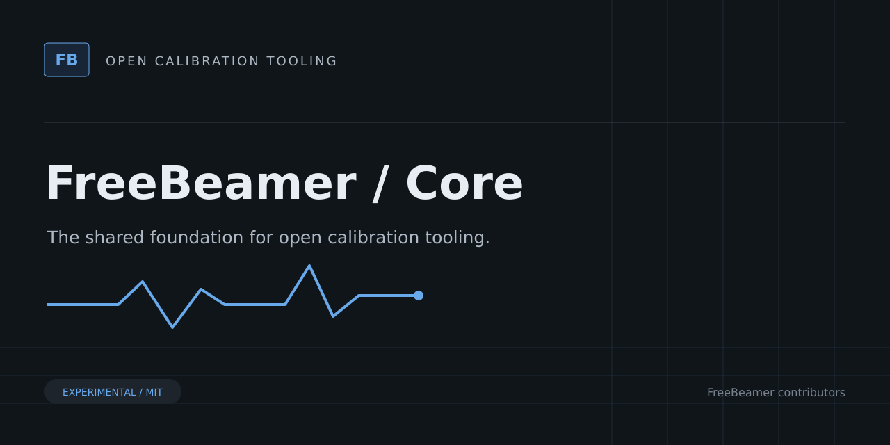

# FreeBeamer Core



Go libraries for ECU calibration formats, binary editing, checksums, vehicle profiles, and telemetry contracts.

> [!WARNING]
> Experimental software. Not validated for vehicle use. Do not flash files produced by FreeBeamer.

The shared Go module owns `pkg/`, the published `.mapdef` schema, synthetic examples, and architecture/compatibility documentation. It includes calibration and live-data libraries; vehicle compatibility remains unverified.

Start with [the project overview](docs/project-overview.md), [format policy](docs/xdf-compatibility.md), and [vehicle support matrix](docs/vehicle-support-matrix.md).

## Development

```sh
go test ./...
go vet ./...
```

## Related projects

- [CLI](https://github.com/freebeamer/cli) — Command-line tools for inspecting calibration files, reviewing binary changes, verifying checksums, and collecting experimental live data.
- [Desktop](https://github.com/freebeamer/desktop) — Experimental ECU calibration editor and live-data viewer built with Go, Wails, Angular, and Plotly.
- [Relay](https://github.com/freebeamer/relay) — Self-hosted Go telemetry relay with authenticated ingestion, SQLite storage, session history, and WebSocket live feeds.
- [Mobile](https://github.com/freebeamer/mobile) — Experimental Flutter companion for read-only MHD/ENET live-data acquisition and upload to a FreeBeamer telemetry relay.

## Contributing and license

See [CONTRIBUTING.md](CONTRIBUTING.md). Source and original artwork are licensed under [MIT](LICENSE). Do not submit proprietary firmware, customer files, secrets, or identifying vehicle data.
