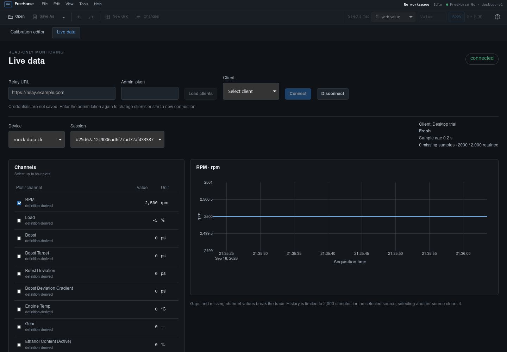

# Desktop live-data consumer: sustained-run evidence

Status: one recorded run of `internal/desktop`'s `TestSoak`, covering the
Go relay consumer (`LiveData`) in isolation. This does not cover Wails IPC
or Angular rendering overhead — that's increment 4b's own manual full-app
run to record separately in the separate increment 4b run recorded below. Neither
substitutes for the other; see
[live data and vehicle mapping plan](live-data-and-vehicle-mapping-plan.md)'s
Phase 4 section for why both are required.

## Procedure

```sh
go test -tags soak ./internal/desktop/... -run TestSoak -v -timeout 120s \
  -cpuprofile=/tmp/livedata-cpu.out -memprofile=/tmp/livedata-mem.out
go tool pprof -top -nodecount=10 /tmp/livedata-cpu.out
go tool pprof -top -nodecount=10 -alloc_space /tmp/livedata-mem.out
```

`TestSoak` is gated behind the `soak` build tag (not just `-short` —
this repo's own `make test`/`go test ./...` convention runs without
`-short`, so a `-short`-only guard would silently make an expensive test
part of every routine run; a build tag excludes the file from
compilation entirely unless explicitly requested). It drives a real
`internal/relay` server (real SQLite store) and
posts synthetic v2 samples directly to `POST /v1/telemetry` (bypassing
`pkg/telemetry.Uploader`'s own queue/spool/retry machinery, which has its
own separate test coverage — this test isolates the desktop consumer, not
Phase 3's delivery reliability), while a real `LiveData` is connected and
consuming `GET /v1/live`.

## Recorded run (2026-09-16, this environment)

15,000 samples across 3 sessions (5,000 sequential samples per session,
one `RPM` channel value each), posted as fast as the local relay could
accept them:

- **Post phase**: 2.60s wall time, ~5,777 samples/s (this is the relay's
  own SQLite-write throughput on this machine, not `LiveData`'s
  throughput — every POST is a separate synchronous HTTP round trip
  through the relay's real store).
- **Fully drained** (every posted sample observed arriving through
  `LiveData`'s emitted batches): 2.75s wall time from the start of
  posting — i.e. the consumer kept up with production throughout, no
  growing backlog.
- **Dedup window**: stayed exactly at its configured cap (200 entries)
  throughout, confirmed via a direct assertion at the end of the run —
  it does not grow with sample count, as designed.
- **Per-session tracking**: exactly 3 tracked sessions at the end (one
  per posted session), confirming `lastSeq` tracking doesn't leak entries
  across a bounded set of active sessions.

CPU profile (top contributors, `-cpuprofile`): dominated by
`modernc.org/sqlite` (`_sqlite3VdbeExec`, `_walChecksumBytes`,
`_yy_reduce`) and `internal/runtime/syscall/linux.Syscall6` — i.e. the
**relay's own SQLite writes**, not `LiveData`'s own logic. No
`LiveData`-specific function (dedup, gap detection, batching, JSON
decode) appeared in the top 10 by flat time. This is reassuring: the
consumer being validated here is not the bottleneck in this test's own
setup, and a real relay under real production load would show the same
SQLite-bound profile regardless of how many desktop consumers are
attached.

Memory profile (top contributors, `-alloc_space`): the single largest
allocator was `fakeEmitter.AllSamples()` (~146 MB of the ~444 MB total) —
this is a **test-harness artifact**, not evidence about `LiveData`
itself: the test's polling helper (`waitFor`) calls `AllSamples()`
repeatedly, and each call defensively copies the entire accumulated
sample slice. A real Wails consumer never does this — it receives each
batch once, as it's emitted. The next largest contributors
(`internal/relay.(*SQLiteStore).SaveSample` and JSON
encode/decode machinery) are relay-side and HTTP-transport allocations,
not `LiveData`'s own state (dedup window, source set, per-session
tracker), which are small, bounded maps/slices by design (see
`docs/live-data-and-vehicle-mapping-plan.md`'s Phase 4 section).

## Increment 4b: Wails and Angular streaming check (2026-09-16)

The separate opt-in harness `scripts/desktop-live-smoke.py` exercises a mock
DoIP TCP adapter, the real `freebeamer mhd monitor` CLI (including decoding,
queue/spool/upload), a real SQLite relay, the running desktop Go backend, Wails'
browser development bridge, Angular, and real Plotly rendering in WebKitGTK.
It creates an isolated temporary relay/client/spool and removes them on exit.
It does not contact a deployed relay or a vehicle.

Prerequisites: the normal Wails/Angular development dependencies, Linux
WebKitGTK 4.1, GTK 3, Python GI bindings, and `xvfb-run`. From the repository root:

```sh
.tools/go/bin/go build -o /tmp/freebeamer-4b ./cmd/freebeamer
.tools/go/bin/go build -o /tmp/freebeamer-relay-4b ./cmd/freebeamer-relay
# Terminal 1: run the real desktop backend and Angular development server.
PATH="$PWD/.tools/go/bin:$PWD/.tools/bin:$PATH" GDK_BACKEND=x11 xvfb-run -a \
  .tools/bin/wails dev -tags webkit2_41 -s -skipbindings -m -nosyncgomod \
  -nogorebuild -noreload -devserver 127.0.0.1:34116
# Terminal 2: wait for Wails to report its development URL, then run:
GDK_BACKEND=x11 xvfb-run -a /usr/bin/python3 scripts/desktop-live-smoke.py
```

Keep application source unchanged during the run so the Angular development
server does not reload its state. The harness accepts `--desktop-url`,
`--cli-bin`, `--relay-bin`, and `--screenshot` overrides. It exits nonzero on
failed assertions or timeout and prints resource snapshots (RSS in KiB and
cumulative CPU time from `ps`) for its CLI, relay, and WebKit subprocesses.

Recorded run: 2,285 adapter replies in 46.35 seconds including startup and
cleanup. At 40 seconds the adapter had served 1,973 replies (~49.3 replies/s,
against a configured 20 ms interval). The script checked 2,500 rpm and -5% load
from explicit little-endian raw mock values; cleared the credential field;
switched editor → live without stopping monitoring; changed the selected source;
and confirmed that history stayed at exactly 2,000 samples while new samples
continued arriving. At completion the status was connected/fresh, acquisition
age displayed 0.2 seconds, and there was no UI error.

During that run the WebKit renderer's RSS at 10/20/30/40 seconds was
483,480 / 447,580 / 459,476 / 464,192 KiB, with cumulative CPU time
2 / 4 / 5 / 7 seconds. Relay RSS grew from 22,580 to 25,004 KiB; CLI RSS
was approximately 16,100 KiB. These are development-mode process snapshots,
not a production performance budget or proof of long-duration memory stability.
The separately running Wails Go process was approximately 239,168 KiB RSS
(1 second cumulative CPU) in a contemporaneous snapshot; it is not included
in the harness's child-process resource list.

A separate direct-to-relay synthetic run injected one missing sequence and
verified the visible gap count and a null separator in the real Plotly trace.
It posted 2,095 samples without HTTP errors over 44.17 seconds; the UI retained
2,000 samples, rendered 2,001 points including the gap separator, and remained
fresh. That run bypassed CLI acquisition; the DoIP run above covers acquisition.

The Wails/Vite development-server log also emitted `Unknown message from front
end: runtime:ready` and startup `TypeError: null is not an object (evaluating
'r.nodes')` diagnostics. The known-value, selection, and rendering assertions
still passed. Their cause was not established in this run; the smoke harness
checks UI outcomes, not absence of browser-console errors. These diagnostics
remain a development-bridge follow-up, and this run must not be described as a
console-error-free native-window trial.

Limits: this uses Wails' development browser bridge in a separate WebKit window,
not automation of the packaged native window. Physical vehicle/adapter and
remote-network acceptance remain pending. The short sustained runs and automated
regressions do not establish hours-long stability or vehicle compatibility.

Recorded WebKitGTK UI from that mock run:


