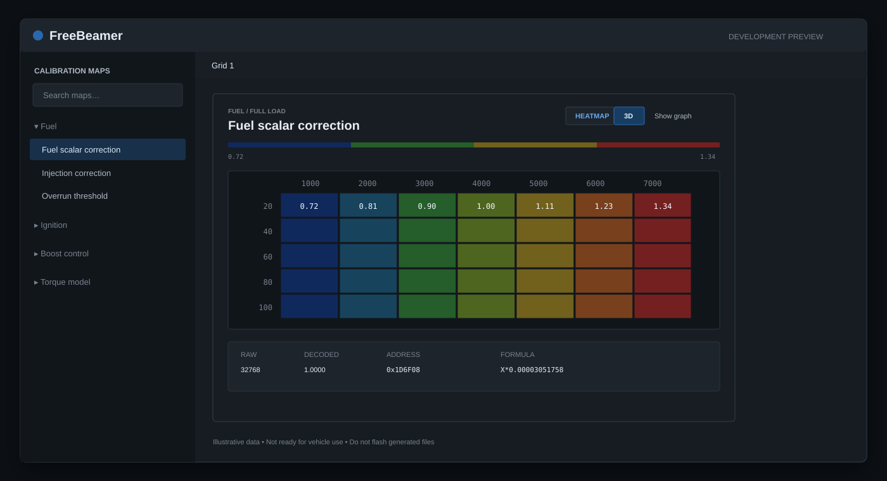
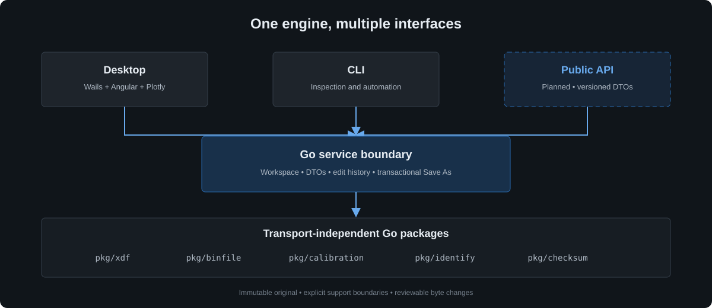

# FreeBeamer

> [!WARNING]
> **FreeBeamer is experimental software under active development. It is not
> ready for real-world ECU calibration or vehicle use. Do not flash files
> produced by FreeBeamer.** Features, file-format support, APIs, and safety
> behavior may change without notice.

FreeBeamer is an open-source toolkit and desktop application for inspecting,
visualizing, and eventually editing automotive ECU calibration data. Its goal
is to provide a transparent, auditable foundation for calibration tooling: a
reusable Go engine, a scriptable command-line interface, a native desktop
editor, and a future public API built on the same safety-conscious core.

FreeBeamer is not an ECU flasher. An experimental read-only live-data path is
implemented and mock-tested; physical vehicle compatibility remains unverified.
A successful checksum verification is not evidence that a binary is safe to flash.



_Development interface overview using illustrative data. The desktop UI is
evolving and is not a production release._

## Why FreeBeamer exists

ECU calibration work often depends on closed tools, opaque file handling, and
firmware-specific assumptions that are difficult to inspect or automate.
FreeBeamer aims to separate the reusable engineering problems into clear,
testable layers:

- parse calibration definitions without modifying firmware;
- keep the original binary immutable while edits operate on a working copy;
- decode raw values into engineering units and safely invert supported formulas;
- make every changed byte reviewable before a file is written;
- keep checksum behavior explicit, firmware-specific, and independently validated;
- expose the same capabilities through desktop, CLI, and API surfaces.

The project is intended for developers, researchers, calibration-tool authors,
and experienced reverse engineers who need an open foundation—not a turnkey
tuning product.

## What it can do today

### Calibration engine and CLI

- Parse the supported subset of TunerPro's native XDF 1.70 calibration-definition format.
- Convert XDF definitions into FreeBeamer's versioned `.mapdef` JSON format with
  provenance and import diagnostics.
- Parse a narrow, evidence-based subset of A2L (ASAM MCD-2 MC) scalar
  characteristics and convert them into `.mapdef` too.
- Inspect XDF metadata, categories, axes, formulas, and table dimensions.
- Open BIN/XDF pairs and decode scalar, one-axis, and matrix calibrations.
- Evaluate and invert supported affine conversion formulas.
- Edit supported cells into a working binary image.
- Compare binaries and report byte-level changes.
- Identify supported firmware characteristics.
- Verify checksums through registered, firmware-specific providers.
- Correct calibration checksum regions for the independently validated BMW
  MEVD17.2.6 `75P9EJ0B` layout.

### Desktop application

- Native Wails and Go application with an Angular/TypeScript interface.
- Conventional calibration-editor layout with map navigation on the left and
  a freeform multi-map workspace.
- Compact scalar editing and editable one-axis/matrix tables.
- ECU-style value coloring with negative-value handling.
- Coordinated line, heatmap, and 3D surface visualizations.
- Cell metadata including decoded value, raw value, units, formula, address,
  and changed state.
- Undo, redo, restore-original, byte-diff review, checksum verification, and a
  guarded Save As workflow.
- Original BIN protection: saving is directed to a new output path.
- Standalone relay live-data viewer with source selection, channel values, bounded
  time-series charts, and freshness/gap indicators.

Visualization is optional and hidden by default. The editable table remains
the source of truth.

## What it does not do

- Flash or program an ECU.
- Provide verified live-data compatibility with a physical vehicle or general OBD/CAN support.
- Guarantee that a modified file is mechanically safe or suitable for an engine.
- Provide general checksum support for every ECU or every MEVD17 variant.
- Support every XDF feature, formula, axis type, or binary layout.
- Replace professional validation, logging, dyno testing, or qualified review.

## File-format scope

FreeBeamer uses `.mapdef` as its canonical persisted definition format. The
format is a constrained, A2L-aligned JSON model with a published
[JSON Schema](../schemas/mapdef-v1.schema.json). XDF is an import format rather
than the desktop, CLI, or planned API contract. See the
[format decision](adr/0001-mapdef-canonical-format.md) and
[XDF compatibility policy](xdf-compatibility.md).

XDF is TunerPro's native format for describing how addresses and raw values in
a BIN correspond to calibration items and engineering values. It is not a
universal ECU-definition standard, even though other tools may provide partial
compatibility. FreeBeamer implements only the semantics documented in
[implemented XDF semantics](xdf-v0.md); loading an `.xdf` file does not
imply that every item or expression in it is supported.

A2L (ASAM MCD-2 MC) import is at an earlier, smaller stage than XDF: the
official specification is not freely available, so FreeBeamer's parser is
built from independent, redistributable evidence rather than the official
text. See [A2L V0 plan](a2l-v0-plan.md) for exactly what was used and
[A2L compatibility policy](a2l-compatibility.md) for what is currently
supported — a single scalar characteristic shape, nothing else yet.

FreeBeamer is an independent interoperability project and is not affiliated
with, endorsed by, or sponsored by TunerPro or Creational Technologies LLC.
TunerPro and related names may be trademarks of their respective owners. This
repository does not distribute TunerPro software, and third-party XDF files
must not be redistributed without permission from their authors.

## Safety model

FreeBeamer treats firmware modification as a high-risk operation.

1. The loaded BIN is retained as an immutable original.
2. Edits are applied to a separate working image.
3. Unsupported or invalid maps are surfaced as diagnostics rather than guessed.
4. Checksum correction is provided only by an explicitly registered provider.
5. The supported provider refuses code-region damage and unknown layouts.
6. Save As clones, corrects, verifies, and writes a new file; it does not
   overwrite the input BIN.

These controls reduce accidental corruption. They do **not** make generated
files safe to flash.

## Architecture



The domain packages do not depend on Wails or Angular. The desktop service,
CLI, and planned API are adapters around the same Go packages:

- `pkg/types` — shared format and domain data contracts;
- `pkg/utils` — small reusable parsing and normalization helpers;
- `pkg/mapdef` — `.mapdef` validation and JSON persistence;
- `pkg/xdf` — isolated XDF parsing and conversion to shared map-definition types;
- `pkg/a2l` — isolated A2L parsing and conversion to shared map-definition types;
- `pkg/binfile` — immutable-original and mutable-working binary images;
- `pkg/calibration` — decoding, encoding, axes, and addressed map operations;
- `pkg/identify` — firmware identification primitives;
- `pkg/checksum` — provider registry and verification contracts;
- `internal/desktop` — workspace lifecycle, DTOs, history, dialogs, and safe
  save orchestration;
- `frontend/` — Angular desktop interface and Plotly visualizations;
- `cmd/freebeamer` — command-line adapter.

See [the desktop implementation plan](desktop-v1-plan.md),
[implemented XDF semantics](xdf-v0.md), and the
[checksum validation record](phase8-checksum-validation.md) for more detail.

## Planned API

A public API is planned so external tools can use FreeBeamer without embedding
the desktop application. The intended direction is a versioned service over
the existing Go engine, with explicit DTOs for workspaces, maps, edits, diffs,
and checksum results.

The API will preserve the same boundaries as the desktop application:

- clients will not receive unrestricted mutation access to BIN memory;
- map IDs will be stable within a workspace and will not depend on titles;
- writes will remain transactional and directed to new output files;
- checksum capabilities will report their exact provider and support status;
- breaking contracts will be versioned rather than changed silently.

The transport, authentication model, deployment model, and SDK strategy are not
final. Contributions and design discussion are welcome before the contract is
stabilized.

## CLI examples

```text
freebeamer xdf info definition.xdf
freebeamer xdf convert definition.xdf --output definition.mapdef
freebeamer a2l info definition.a2l
freebeamer a2l convert definition.a2l --output definition.mapdef
freebeamer maps list --xdf definition.xdf
freebeamer maps show --xdf definition.xdf --bin original.bin --name "Map title"
freebeamer maps set --xdf definition.xdf --bin original.bin --map "Map title" --row 0 --col 0 --value 1.25 --output modified.bin
freebeamer diff original.bin modified.bin
freebeamer identify original.bin
freebeamer inspect --xdf definition.xdf --bin original.bin
freebeamer checksum verify original.bin
freebeamer checksum fix modified.bin --output modified-fixed.bin
```

## Development status

The desktop **Live data** view connects to a relay without opening an XDF/BIN
workspace. Enter the relay URL and admin token, load and select a client, then
connect. It shows device/session readings, channel units, sample age, gaps,
backfill/reconnect status, and up to four time-series plots. History is capped at
2,000 samples for the selected source; changing source clears that history.
Credentials are not saved, and the token field is cleared on Connect. Monitoring
continues when switching back to the calibration editor. Operating-point
overlays are not implemented yet.

The desktop **Vehicle profiles** view lets an operator bind a workspace's
explicit numeric map axes to a connected source's telemetry channels. A
profile is saved locally, then explicitly associated; saving and associating
both re-evaluate compatibility against the current workspace/session
identity, and any mismatch refuses the change. Reopening the workspace,
reconnecting, or selecting a different source invalidates an active
association until it is explicitly redone. Association is manual and
unverified: there is no reviewed real-vehicle evidence registry yet, so a
"validated" status is never available from this UI. See the
[vehicle profile and binding format](vehicle-profile-format.md) for the
persisted format and exact compatibility rules.

The next live-data milestone is tracked in the
[live data and vehicle mapping plan](live-data-and-vehicle-mapping-plan.md).
It covers hardware validation, reliable acquisition, desktop telemetry, and
explicit bindings between vehicle readings and calibration maps. See the [vehicle support matrix](vehicle-support-matrix.md) and
[hardware validation procedure](vehicle-hardware-validation.md) for current
evidence and the first trial workflow.

FreeBeamer is pre-release software. There is no stable release, compatibility
promise, or production-ready API. Current work is focused on desktop workflow,
visualization correctness, validation, test coverage, and defining a narrow
public API.

BIN/XDF editing is experimental. BMW MEVD17.2.6 `75P9EJ0B` calibration
checksum support has been independently cross-checked, but remains subject to
the project-wide no-flashing warning.

## Contributing

Contributions are welcome—especially focused bug reports, tests using legally
shareable synthetic fixtures, XDF compatibility improvements, documentation,
accessibility work, and review of the planned API.

Start with [CONTRIBUTING.md](../CONTRIBUTING.md). Please open an issue before a
large architectural change so effort can be coordinated. Never attach or
commit proprietary firmware, customer files, keys, or identifying vehicle data.

## Proprietary data policy

Private firmware and definition fixtures belong in `testdata/private/`, which
is ignored by Git. Contributors must have the right to use every submitted
fixture. Converting a definition does not change its copyright, confidentiality,
or licence status. Prefer minimal synthetic test data that demonstrates one
behavior without containing third-party firmware or definition content.

## License

FreeBeamer is available under the [MIT License](../LICENSE).

The license permits use and modification but provides the software without
warranty. It does not grant rights to third-party firmware, calibration
definitions, trademarks, or vehicle software.
